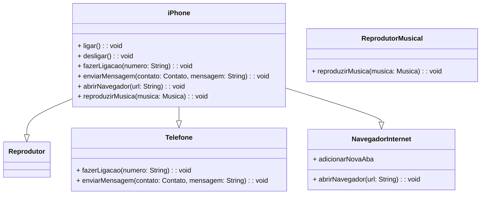

# Orientação a Objetos e UML: Diagramação de Classes do IPhone

## Diagrama de Classes

```mermaid
classDiagram
    class iPhone {
        
        + ligar(): void
        + desligar(): void
        + fazerLigacao(numero: String): void
        + enviarMensagem(contato: Contato, mensagem: String): void
        + abrirNavegador(url: String): void
        + reproduzirMusica(musica: Musica): void
    }
    
    class ReprodutorMusical {
        + reproduzirMusica(musica: Musica): void
    }
    
    class Telefone {
        + fazerLigacao(numero: String): void
        + enviarMensagem(contato: Contato, mensagem: String): void
    }
    
    class NavegadorInternet {
        + abrirNavegador(url: String): void
        + adicionarNovaAba
    }
    
    
    iPhone --|> Reprodutor
    iPhone --|> Telefone
    iPhone --|> NavegadorInternet
```
